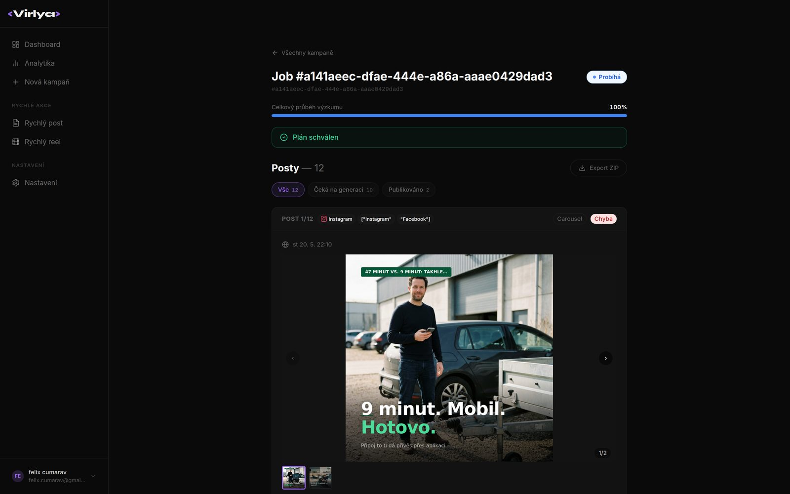
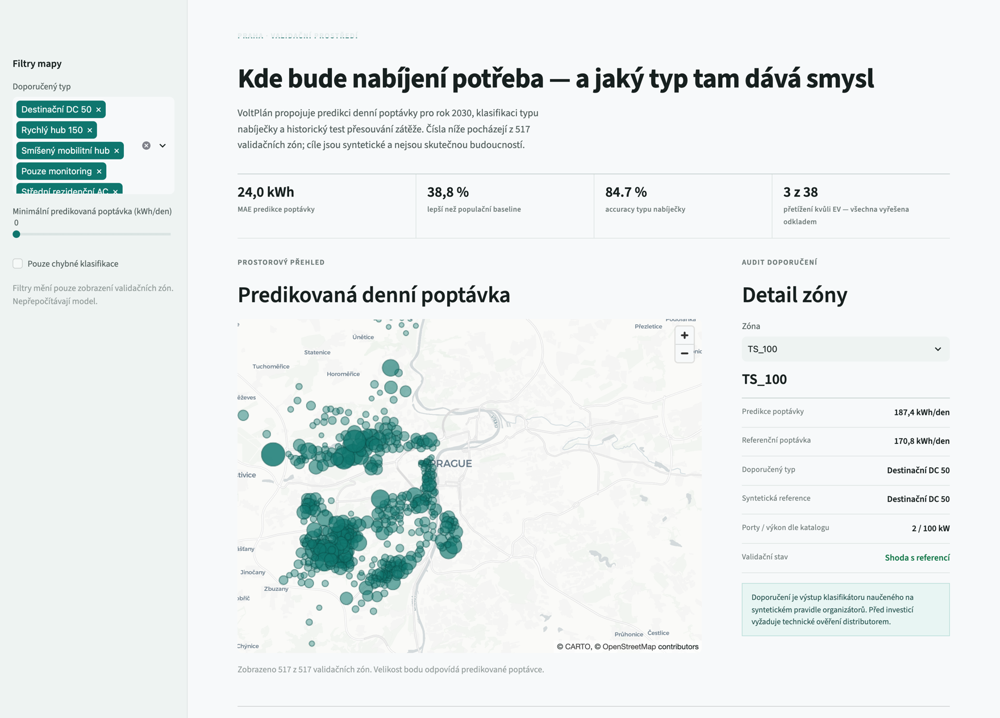

  

 

I design and ship end-to-end — mobile apps, backend infrastructure, and AI agents that act on real systems instead of just answering questions. Two of my projects reached the **ČAIO 2026 (Czech AI Olympiad) national final**. I build automation agents that drive real operating systems through the accessibility tree rather than guessing from screenshots, and I've taken products from a blank repo through to Stripe payments and smart-lock hardware in production.

 

## 🚀 Featured Projects

<table>
<tr>
<td width="50%" valign="top">

### 🦅&nbsp; [Kestrel](https://github.com/cufelix/kestrel)
A desktop agent with hands and memory. Fork of `sst/opencode`, extended with real OS control — opening apps, clicking and reading UI elements via the accessibility tree — plus a persistent memory of the machine it runs on.

</td>
<td width="50%" valign="top">

### 🐧&nbsp; [LAI](https://github.com/cufelix/lai)
A native OS agent for Linux. Reads the AT-SPI accessibility tree to find and invoke real UI elements by name and action — pixel/screenshot-based control is only the fallback, never the main strategy.

</td>
</tr>
<tr>
<td width="50%" valign="top">

### 🪄&nbsp; [Virlya](https://virlya.com)
An autonomous social-media content pipeline: 10 specialized AI agents turn a single brief into a full multi-platform campaign — web research, strategy, on-brand copywriting, photorealistic visuals, and publish-ready posts for Instagram, Facebook, X, LinkedIn and TikTok. Human approves the plan before generation runs, and can approve or reject posts straight from a Telegram chat.

**🔴 Live product — [virlya.com](https://virlya.com)**

</td>
<td width="50%" valign="top">

### 🔌&nbsp; [VoltPlán](https://github.com/cufelix/notokens_olymp)
A V2G-based EV-charging infrastructure plan for Prague: a model predicting 2030 demand, a classifier recommending the right charging-solution type per zone, and a load-shifting layer that resolves grid overloads by delaying charge windows instead of new hardware.

**🏆 ČAIO 2026 — AI Startup track finalist**

</td>
</tr>
<tr>
<td width="50%" valign="top">

### 🚐&nbsp; [Pripoj.to](https://github.com/cufelix/voz01)
A complete trailer-rental platform: React Native app, Next.js admin panel, Firebase Cloud Functions backend, Stripe payments, and Igloohome smart-lock integration for keyless pickup.

</td>
<td width="50%" valign="top">

### 🛸&nbsp; [ESP32 Whoop Drone](https://github.com/cufelix/Arduino)
A 65mm brushed-motor whoop drone flown with just an ESP32 + ESP32-CAM and a laptop as ground station — **no flight controller board, no IMU**. Stabilization is solved in software instead of with dedicated flight-control hardware.

</td>
</tr>
</table>

<b>More public projects</b>

 

| Project | Description |
|---|---|
| [newjava](https://github.com/cufelix/newjava) | A Java game engine paired with a raycasting engine, built from scratch |

 

## 🔒 Private / Team & Client Work

Some of my work lives in private repos — hackathon team code, client projects, and in-progress apps not yet ready to open up. Happy to walk through any of these:

- **NanoClaw (`spndr`)** — a self-hosted, multi-channel AI agent platform (WhatsApp / Telegram / Slack), each conversation running in its own isolated container. Built on top of the open-source [NanoClaw](https://nanoclaw.dev) framework, customized and extended for a hackathon project (87 of my own commits on top of the base framework).
- **Forksy** — a nutrition-tracking mobile app (React Native / Expo).
- **PhAuth** — a phone-number authentication flow for mobile apps (React Native / Expo).
- Client web project (private, available on request).

 

## 🛠️ Tech Stack

 

## 📊 GitHub Stats

  

